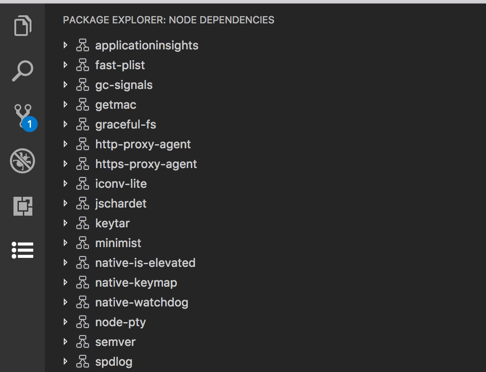

# Views & View Containers

This extension is designed try to collect all activities in vscode. 

This extension is based on ms vscode example https://github.com/microsoft/vscode-extension-samples, and provides the similar feature like ms vscode example, also provide more features to help your daily work.



This extension provides following features for now

- quck access to folders,files,url,batches,tools... only in vscode by json configuration.

## How to work with DevAllInOne
- Open any folder with vscode
- Put a json file named "config.json" rootpath/of/your/workspace/conf/config.json
- The json file final child node shuold look like "TYPE|RESERVED|RESERVED|ACTION|ARGUMENTS"
- Example:
```json
{
	"integrationBuild": {
		"cmd_test": "CMD|||../../test.cmd",
		"check": {
			"Reset":"CMD||Reserved|../../reset.bat",
			"Stash":"CMD||Reserved|../../stash.bat",
			"None":"CMD||Reserved|../../none.bat"
		},
		"DevEnv_Git_Bash":"CMD|||git-bash.exe|--cd=${rootPath}/../../"
	},
	"quickAccess": {
		"GenData": "DIR|||./test/Data"
	},
	"pages": {
		"m365":{
			"home":"URL|||https://www.microsoft365.com"
		}
	},
	"docs": {
		"doc_test":{
			"excel":"DOC|||./test/test.xlsm",
			"pdf":"DOC|||./test//test.pdf",
		}
	}
}
```

- By default, ${workspace}/conf/config.json and ${workspace}/conf/config_local.json are imported, you could also specify customized json file(s) in setting views, those files must be seperated by semicolon. All of those json files will be merged if you specified the `JSON merge` as true. you could also press `ctrl + shift + p` to search `DevAllInOne:Select json file` and excute to set the seting json file(s).

## VS Code API

This extension uses following contribution points, activation events and APIs

### Contribution Points

- `views`
- `viewsContainers`
- `menu`
  - `view/title`
  - `view/item/context`

### Activation Events

- `onView:${viewId}`

### APIs

- `window.createTreeView`
- `window.registerTreeDataProvider`
- `TreeView`
- `TreeDataProvider`

Refer to [Usage](./USAGE.md) document for more details.

## Running the Sample

- Open this example in VS Code Insiders
- `npm install`
- `npm run watch`
- `F5` to start debugging
- Node dependencies view is shown in Package explorer view contaier in Activity bar.
- FTP file explorer view should be shown in Explorer

